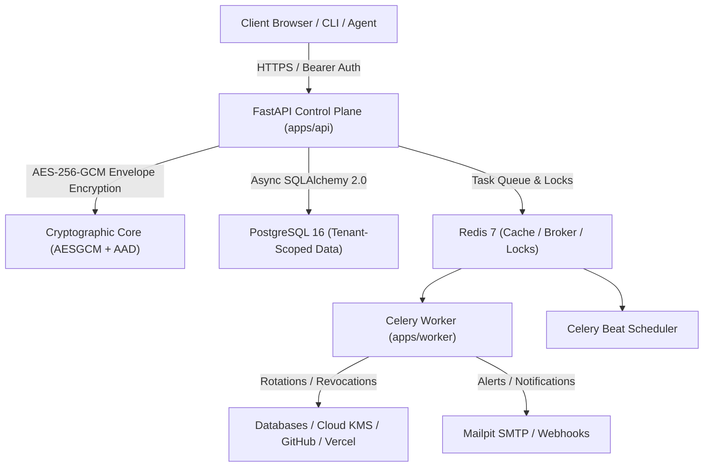

# AegisVault Technical Architecture

AegisVault is an enterprise secret management and security control plane platform designed for multi-tenant, cloud-native, and self-hosted environments.

---

## 1. System Architecture Diagram



---

## 2. Envelope Encryption Architecture

AegisVault implements real envelope encryption using Python's standard `cryptography.hazmat.primitives.ciphers.aead.AESGCM`:

```text
+------------------------------------------------------------------------+
|                          Master Key (MEK)                              |
|           (Stored in External KMS, HSM, or Mounted Secret)            |
+-----------------------------------+------------------------------------+
                                    | Wraps / Decrypts
                                    v
+------------------------------------------------------------------------+
|                 Encrypted Data Encryption Key (DEK)                    |
+-----------------------------------+------------------------------------+
                                    | Decrypts
                                    v
+------------------------------------------------------------------------+
|                      Ephemeral 32-Byte DEK                             |
+-----------------------------------+------------------------------------+
                                    | Encrypts / Decrypts with AAD
                                    v
+------------------------------------------------------------------------+
|                  Encrypted Secret Payload (Ciphertext)                 |
|       AAD: {"org_id": ..., "project_id": ..., "key": ..., "ver": ...}  |
+------------------------------------------------------------------------+
```

---

## 3. Core Capabilities

1. **Secret Versioning & Rollback**: Every secret write produces an immutable version record. Point-in-time rollbacks decrypt the historical target and append a new head version without overwriting history.
2. **Private PKI Engine**: Issues X.509 certificates from Root and Intermediate CAs, validates SAN DNS names, enforces profile constraints, and generates CRLs.
3. **Software KMS**: Provides AES-256-GCM, RSA-PSS, and Ed25519 cryptographic primitives for applications without direct access to raw private keys.
4. **Privileged Access Management (PAM)**: Provides time-bound access approvals with auto-expiration and justification requirements.
5. **Secret Scanner**: Analyzes code files for leaked credentials using regex patterns and Shannon entropy, generating safe redacted previews.
6. **Multi-Target Sync**: Connects to GitHub Actions, Vercel, AWS Secrets Manager, and Kubernetes Secrets.

---

## 4. The Fortress Topology: Independent Towers & Secure Gates

AegisVault enforces a **Fortress Model** where each operational domain stands as an isolated tower protected by strict cryptographic and authorization gates:

### Tower 1: Command Center (Web Console)
- **Role**: Operator and Security officer control room.
- **Location**: `app/` (Next.js 15, React 19, Tailwind v4).
- **Gate Protocol**: HTTPS / mTLS, strict CSP, SameSite=Strict cookies, anti-CSRF tokens, dual-tier rate limiting with justification audits.

### Tower 2: Operations Tower (API & Async Workers)
- **Role**: Central intelligence, cryptographic vault core, lease generation, and rotation scheduler.
- **Location**: `apps/api/` and `apps/worker/` (FastAPI, SQLAlchemy 2.0 Async, Celery, Redis locks).
- **Gate Protocol**: Authenticated Additional Data (AAD) tenant-binding, envelope encryption via KMS/MEK, zero-plaintext memory caches.

### Tower 3: Distributed Weapons (SDKs & Agents)
- **Role**: Client libraries, CI/CD injection tools, and autonomous agent sidecars.
- **Location**: `sdks/` (`sdks/python/`, `sdks/go/`, `sdks/js/`).
- **Gate Protocol**: Machine Identity (Universal Auth, K8s TokenReview, OIDC/JWT), ephemeral memory-only credential injection (`av run`), zero disk persistence.

### Tower 4: Fortress Infrastructure & Ledger (Gates & Citadel)
- **Role**: Orchestration, automated deployment, tamper-evident ledgers, and disaster recovery.
- **Location**: `infrastructure/` and `docs/`.
- **Gate Protocol**: SHA-256 cryptographic hash chaining for audit logs, RFC 5424 Syslog streaming, deterministic zero-plaintext cold-start recovery.

